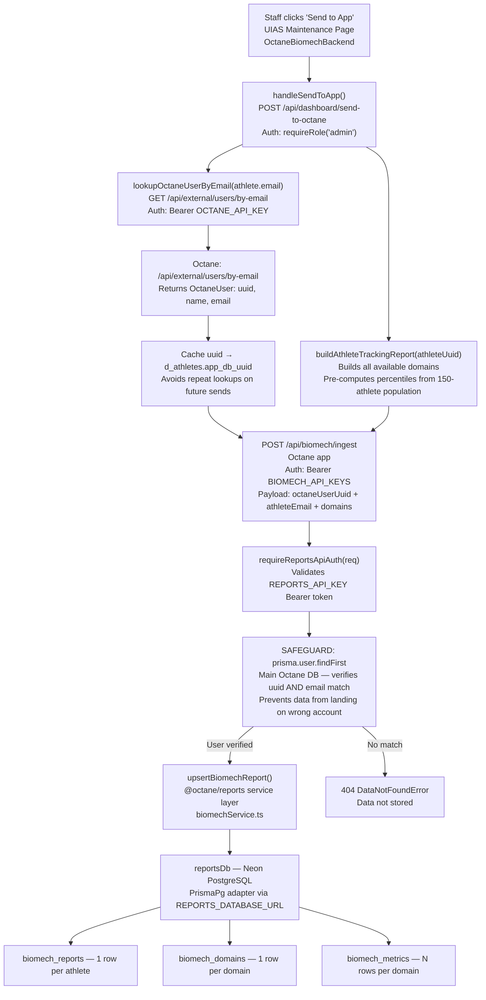
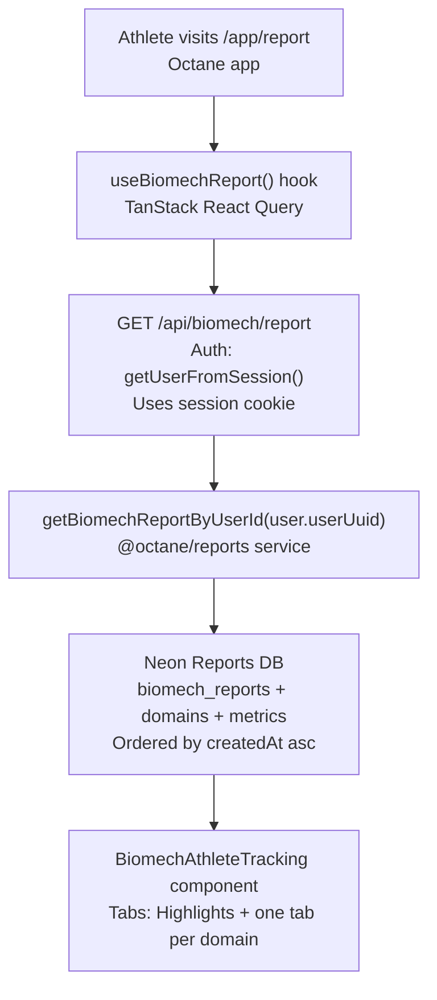
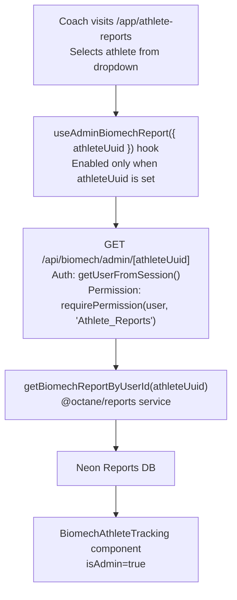
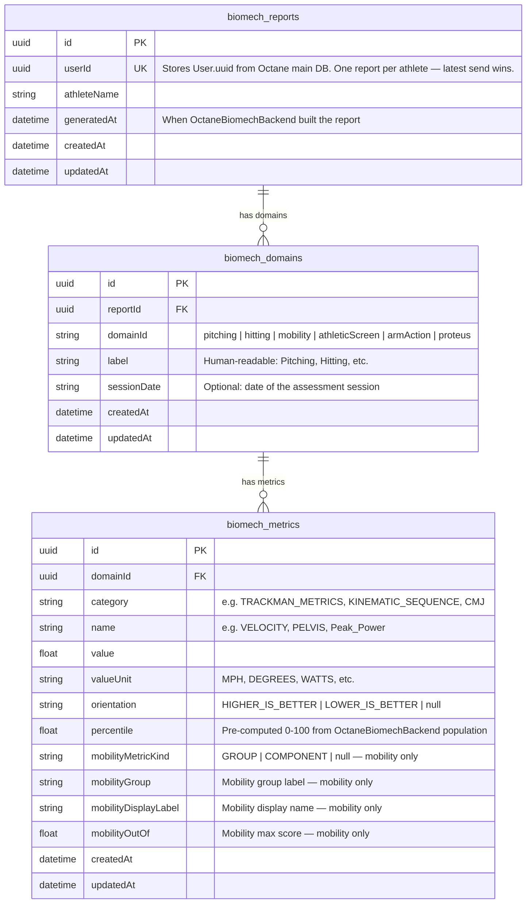
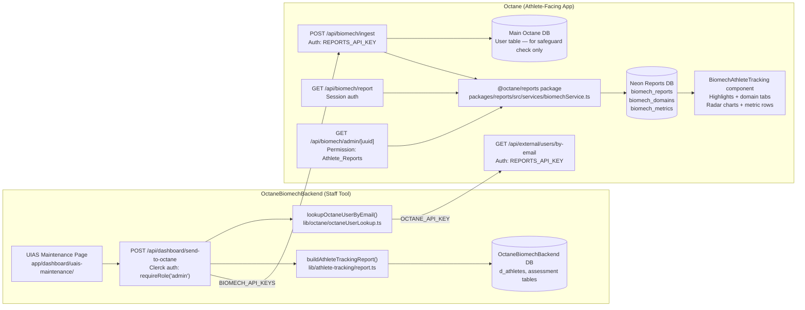

# Biomech Reports Pipeline — Architecture Reference

## Overview

Data flows one-way from **OctaneBiomechBackend** (staff tool) → **Octane** (athlete-facing app).
The trigger is a "Send to App" button on the UIAS Maintenance page. Pre-computed percentiles
travel with the payload — Octane stores and displays them but never recomputes them.

---

## 1. Full Data Flow (Ingest Path)

---

## 2. Data Retrieval (Athlete View)

---

## 3. Data Retrieval (Coach/Admin View)

---

## 4. Database Schema (Neon Reports DB)

> **Why one generic metrics table?** The existing `Metric` table in the reports package uses
> fixed enums (12 pitching-specific categories). Biomech needs open-ended string categories
> that work for all 6 domains. Three new tables were added rather than modifying the existing
> schema to avoid breaking the existing athlete reports feature.

---

## 5. Infrastructure Map

---

## 6. Endpoints Reference

| App | Method | Endpoint | Auth | Purpose |
|-----|--------|----------|------|---------|
| OctaneBiomechBackend | POST | `/api/dashboard/send-to-octane` | Clerk `requireRole('admin')` | Builds report, resolves Octane UUID, POSTs to ingest |
| Octane | GET | `/api/external/users/by-email` | Bearer `REPORTS_API_KEY` | Resolves athlete email → Octane UUID |
| Octane | POST | `/api/biomech/ingest` | Bearer `REPORTS_API_KEY` | Receives payload, validates identity, upserts to Neon |
| Octane | GET | `/api/biomech/report` | Session cookie | Athlete fetches their own report |
| Octane | GET | `/api/biomech/admin/[athleteUuid]` | Session + `Athlete_Reports` permission | Coach fetches any athlete's report |

---

## 7. Environment Variables

| Variable | App | Value |
|----------|-----|-------|
| `OCTANE_APP_API_URL` | OctaneBiomechBackend | URL of the Octane app (e.g. `http://localhost:3000`) |
| `BIOMECH_API_KEYS` | OctaneBiomechBackend | Bearer key for the ingest endpoint — must match `REPORTS_API_KEY` in Octane |
| `OCTANE_API_KEY` | OctaneBiomechBackend | Bearer key for the user-lookup endpoint — must match `REPORTS_API_KEY` in Octane |
| `REPORTS_API_KEY` | Octane | Shared secret validating both OctaneBiomechBackend integrations |
| `REPORTS_DATABASE_URL` | Octane | Neon PostgreSQL connection string — used by `packages/reports/src/db.ts` |

---

## 8. Upsert Behavior (Re-sending Data)

Each "Send to App" replaces all metrics for every domain that is re-sent:

1. `BiomechReport` — upserted by `userId` (one row per athlete, updated in place)
2. `BiomechDomain` — upserted by `(reportId, domainId)` unique constraint
3. `BiomechMetric` — **deleted and recreated** on every send (no stale metrics accumulate)

This means sending Pitching data twice updates only Pitching metrics — Hitting metrics from a
previous send are untouched because their domain row is upserted separately.
